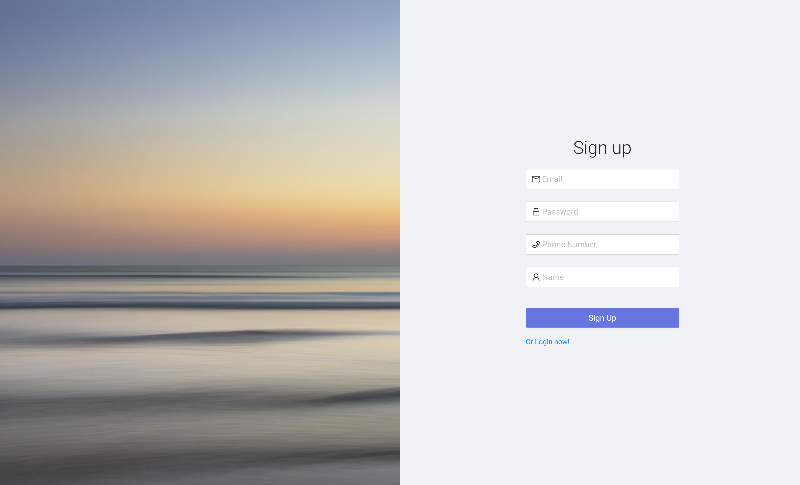
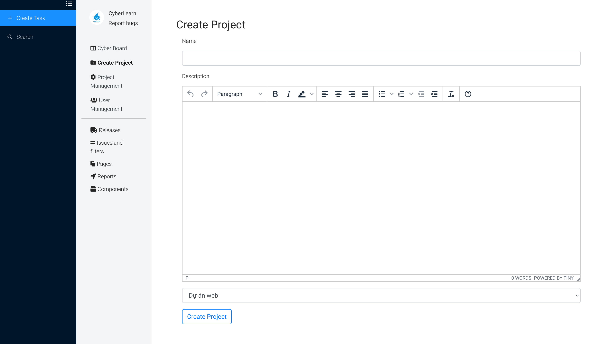
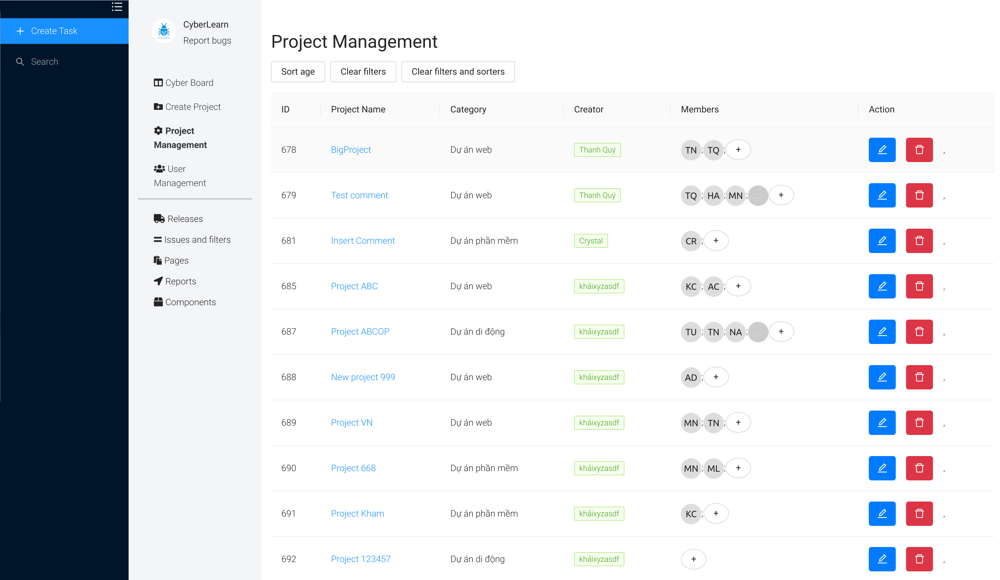
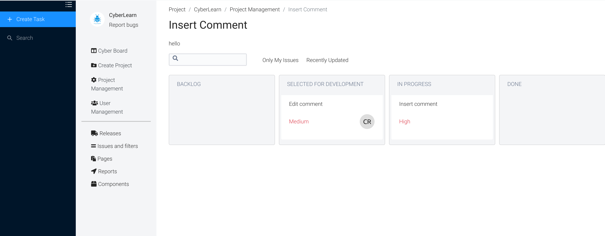
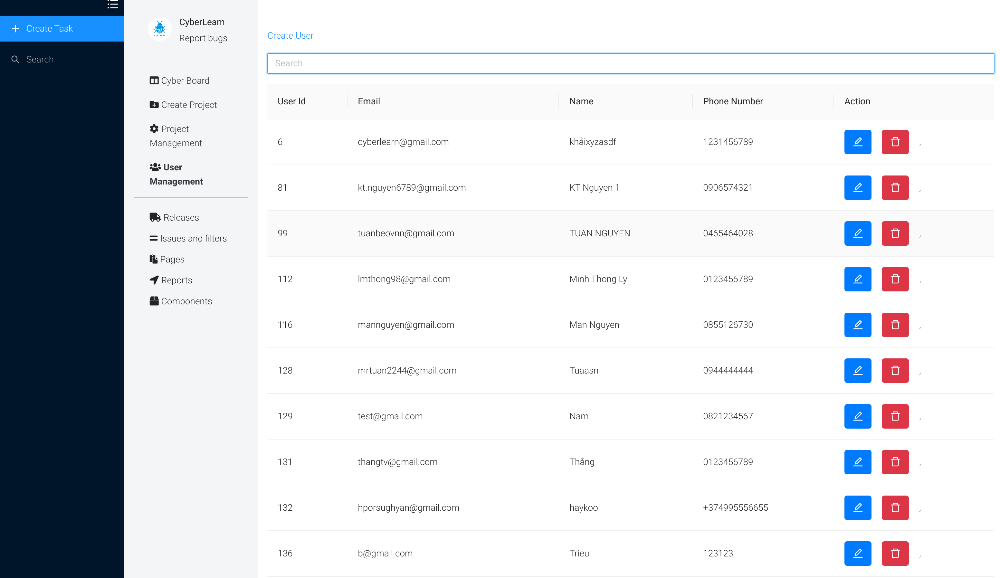
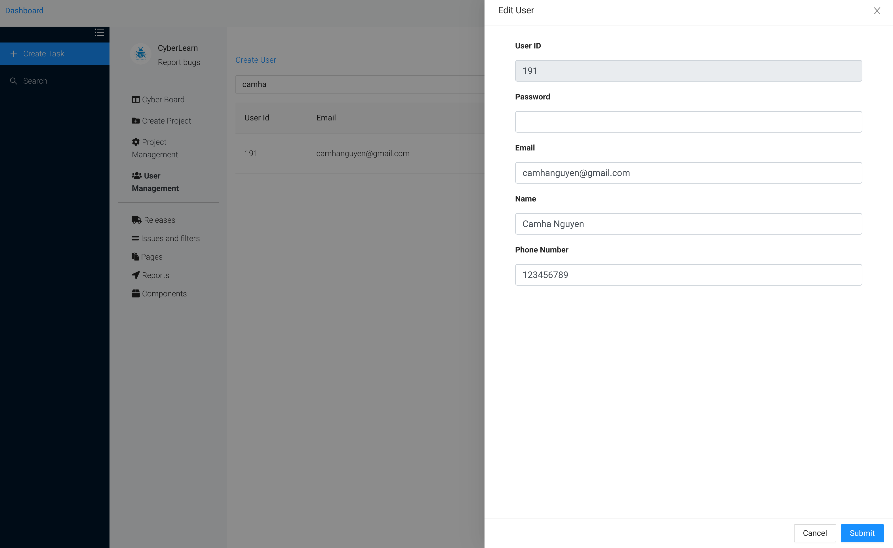

# Getting Started with Create React App

This project was bootstrapped with [Create React App](https://github.com/facebook/create-react-app).

## Available Scripts

In the project directory, you can run:

### `yarn start`

Runs the app in the development mode.\
Open [http://localhost:3000](http://localhost:3000) to view it in the browser.

## A simplified Jira clone built with React

## Project Description

A complex showcase React project written in modern React, only functional components with hooks. Using ant design for UI components such as modal, various form elements. Using redux for React state management.
